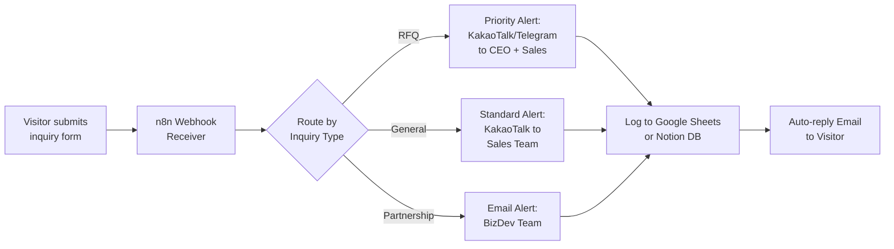

# Product Requirements Document (PRD)
## IT Embedded / B2B — Productized Service Portfolio Landing Page
> **Version:** 1.0 · **Date:** 2026-02-25 · **Author:** Product & Strategy

---

## 1. Executive Summary

This document defines the product requirements for a **one-page portfolio landing page** that sells a productized web renewal service to CEOs of IT Embedded / B2B companies.

### The Problem We Solve for Our Clients
Most IT Embedded companies (IoT device makers, FA machine vision, industrial equipment) rely on **outdated, static websites** that function as digital brochures — failing to generate leads, answer technical inquiries, or operate as revenue infrastructure.

### What We're Building
A single landing page that **demonstrates, not describes**, what a modernized B2B web presence looks like. The page itself acts as a working proof-of-concept:

| Capability | Proof Point on Landing Page |
|---|---|
| Ultra-fast loading | Page itself loads < 1.5s (React + Vercel Edge) |
| Automated lead capture | Live inquiry form → instant CEO alert demo |
| AI-powered CS | Working chatbot answering sample tech specs |
| Zero design meetings | Entire deliverable produced without a single meeting |

### Success Metric
> **Primary KPI:** Inbound inquiry conversion rate ≥ 5% from targeted CEO outreach campaigns (cold email, LinkedIn DM).

---

## 2. Target Audience & Pain Points

### 2.1 Primary Persona: "CEO Kim"

| Attribute | Detail |
|---|---|
| **Role** | CEO / Founder of IT Embedded B2B company |
| **Company Size** | 10–80 employees |
| **Industry** | IoT modules, FA machine vision, embedded boards, industrial sensors, CNC/automation equipment |
| **Annual Revenue** | ₩5B–₩50B |
| **Tech Sophistication** | High — understands specs, APIs, system architecture |
| **Current Website** | Static HTML/WordPress, last updated 2+ years ago |

### 2.2 Pain Points (Ranked by Severity)

1. **"Our website is embarrassing."** The site doesn't reflect their engineering excellence. Overseas buyers judge credibility on web presence.
2. **"We lose RFQs because buyers can't find specs."** Technical datasheets are buried in PDFs or absent entirely. Buyers move to competitors with better online catalogs.
3. **"I don't have time for design meetings."** Past agency experiences involved 6+ revision rounds, hours of calls, and vague "creative direction" discussions — a nightmare for engineering-minded CEOs.
4. **"We have no idea who visits our site or what they want."** Zero analytics, zero lead capture, zero follow-up automation.
5. **"After-hours inquiries go unanswered."** When a buyer in Germany sends an RFQ at 3 AM KST, nobody responds until morning — if at all.

### 2.3 Psychological Triggers

- **Data > Aesthetics** — This persona trusts dashboards, metrics, and architecture diagrams over hero images.
- **Efficiency > Process** — They want outcomes, not "collaborative design journeys."
- **Proof > Promises** — A working demo beats a case study PDF every time.

---

## 3. Core Value Proposition

> **"We turn your outdated B2B website into a 24/7 Automated Sales & CS Infrastructure — without a single design meeting."**

### 3.1 Value Pillars

```
┌────────────────────────────────────────────────────────┐
│           24/7 AUTOMATED SALES INFRASTRUCTURE          │
├──────────────┬──────────────────┬───────────────────────┤
│  PILLAR 1    │  PILLAR 2        │  PILLAR 3             │
│  Speed &     │  Workflow         │  AI-Powered           │
│  Credibility │  Automation       │  Customer Service      │
├──────────────┼──────────────────┼───────────────────────┤
│ React+Vercel │ n8n → Messenger  │ Antigravity Chatbot   │
│ Edge CDN     │ → CRM Auto-log   │ Datasheet Q&A         │
│ < 1.5s Load  │ 0-min response   │ 1st-tier Tech Support │
└──────────────┴──────────────────┴───────────────────────┘
```

### 3.2 Differentiation from Traditional Agencies

| Traditional Agency | This Service |
|---|---|
| 4–8 week timeline | 5 business days |
| 5+ design meetings required | 0 meetings — async only |
| Generic "beautiful" design | Data-driven, spec-focused UX |
| Static website delivery | Automated sales infrastructure |
| No post-launch support | AI chatbot + n8n automation included |
| ₩15M–₩50M budget | Fixed productized price |

---

## 4. Functional Requirements

### 4.1 Frontend — Landing Page Sections

> **Note:** This is a structural breakdown. Wireframe/copywriting is excluded per scope.

| # | Section | Purpose | Key Elements |
|---|---|---|---|
| S1 | Hero | Instant credibility + hook | Headline, sub-headline, single CTA, page speed badge |
| S2 | Problem Statement | Emotional alignment | 3 pain point cards with icons |
| S3 | Before/After Demo | Visual proof of transformation | Interactive slider or tab showing old → new website |
| S4 | System Architecture | Technical credibility | Animated architecture diagram (React → Vercel → n8n → CRM → AI) |
| S5 | Live Automation Demo | Working proof | Inquiry form that triggers real-time messenger notification |
| S6 | AI Chatbot Demo | Working proof | Embedded chatbot answering sample tech spec questions |
| S7 | Deliverables & Pricing | Clarity & conversion | Fixed scope breakdown, transparent pricing tier |
| S8 | FAQ | Objection handling | Expandable accordion (5–7 items) |
| S9 | Final CTA | Conversion | Inquiry form + direct messenger link |

### 4.2 Frontend — Interactive Components

| Component | Behavior |
|---|---|
| **Architecture Diagram** | SVG/Canvas animation. Nodes illuminate sequentially to show data flow: `Visitor → Form Submit → n8n Webhook → KakaoTalk Alert + Google Sheets Log → AI Chatbot Fallback`. On scroll-trigger. |
| **Before/After Slider** | Draggable divider comparing a sample "old B2B site" vs. "renewed site." Touch-friendly. |
| **Speed Benchmark Widget** | Real-time Lighthouse score display or simulated loading comparison (old site 4.2s vs. new site 0.8s). |
| **Inquiry Form (S5)** | Fields: Company Name, Name, Email, Phone, Inquiry Type (dropdown: RFQ / Partnership / General), Message. On submit → live demo of n8n workflow triggering alert. |
| **AI Chatbot (S6)** | Floating widget, bottom-right. Pre-loaded with sample product specs from a fictitious IT Embedded company. Responds to questions like "What's the operating temperature range of Model X?" |

### 4.3 Workflow Automation (n8n Integration)



#### 4.3.1 Webhook Endpoint
- **Trigger:** `POST` to n8n webhook URL on form submission
- **Payload:** All form fields + timestamp + UTM parameters + referrer URL
- **Security:** Webhook URL obfuscated server-side; CORS restricted to landing page domain

#### 4.3.2 Messenger Alert (Real-time)
- **Channels:** KakaoTalk (primary for Korean CEOs) + Telegram (backup/international)
- **Alert Content:** Formatted message with Company Name, Contact Name, Inquiry Type, and Message preview
- **Latency Target:** < 3 seconds from form submission to messenger notification

#### 4.3.3 CRM Auto-logging
- **Primary:** Google Sheets (lowest friction for SMB CEOs)
- **Secondary:** Notion Database (for clients who prefer structured views)
- **Fields Logged:** Timestamp, Company, Contact, Email, Phone, Inquiry Type, Message, Source URL, UTM tags, Status (default: "New")

#### 4.3.4 Auto-reply Email
- **Trigger:** Immediate on form submission
- **Content:** Professional acknowledgment with expected response time (< 2 hours during business hours)

### 4.4 AI Integration (Antigravity Chatbot)

#### 4.4.1 Capabilities
| Tier | Query Type | Example | Response |
|---|---|---|---|
| **Tier 1 — Auto** | Spec lookups | "What's the input voltage range?" | Instant answer from knowledge base |
| **Tier 1 — Auto** | Datasheet requests | "Send me the datasheet for Model ABC" | Auto-serve PDF link or inline specs |
| **Tier 1 — Auto** | General FAQ | "What's your MOQ?" | Pre-configured response |
| **Tier 2 — Handoff** | Custom engineering | "Can you modify the firmware for our protocol?" | Collect details → route to n8n → human alert |

#### 4.4.2 Knowledge Base
- Pre-loaded with sample product catalog (3–5 fictitious products with realistic specs)
- Structured as JSON/Markdown documents for easy client customization
- Supports: product names, model numbers, specifications, certifications, datasheets

#### 4.4.3 Behavior Rules
- Always respond in the visitor's detected language (Korean/English)
- Never fabricate specs — if unknown, respond: "I'll connect you with our engineering team for that detail."
- On Tier 2 escalation → auto-trigger n8n workflow identical to form submission
- Conversation history logged to CRM for sales team context

---

## 5. Non-Functional Requirements

### 5.1 Performance

| Metric | Target | Measurement |
|---|---|---|
| First Contentful Paint (FCP) | < 1.0s | Lighthouse CI |
| Largest Contentful Paint (LCP) | < 1.5s | Lighthouse CI |
| Cumulative Layout Shift (CLS) | < 0.05 | Lighthouse CI |
| Time to Interactive (TTI) | < 2.0s | Lighthouse CI |
| Lighthouse Performance Score | ≥ 95 | Lighthouse CI |
| n8n Webhook Response | < 3s end-to-end | Custom monitoring |
| AI Chatbot First Response | < 2s | Custom monitoring |

### 5.2 SEO & Discoverability
- Semantic HTML5 structure
- Pre-rendered meta tags (Open Graph, Twitter Card) for link preview on KakaoTalk/LinkedIn
- Structured data (JSON-LD) for Organization + Service
- Sitemap.xml + robots.txt
- Target keywords: B2B website renewal, IT embedded web development, factory website automation (Korean equivalents prioritized)

### 5.3 Accessibility
- WCAG 2.1 Level AA compliance minimum
- Keyboard-navigable interactive components
- Proper ARIA labels on all interactive elements
- Color contrast ratio ≥ 4.5:1

### 5.4 Security
- HTTPS enforced (Vercel default)
- Form input sanitization (XSS, injection prevention)
- Webhook URL not exposed in client-side code (proxy through Vercel serverless function)
- Rate limiting on form submissions (max 5/min per IP)
- CAPTCHA (invisible reCAPTCHA v3) on inquiry forms

### 5.5 Browser & Device Support

| Category | Targets |
|---|---|
| Desktop | Chrome, Edge, Safari (latest 2 versions) |
| Mobile | iOS Safari, Android Chrome |
| Viewport | Fully responsive 360px–2560px |
| Priority | Mobile-first (CEO reading on phone via KakaoTalk link) |

---

## 6. Tech Stack Setup

### 6.1 Architecture Overview

```
┌─────────────────────────────────────────────────────────────┐
│                        VERCEL EDGE                          │
│  ┌───────────────┐  ┌──────────────┐  ┌──────────────────┐  │
│  │  React SPA    │  │ Serverless   │  │  Vercel          │  │
│  │  (Vite Build) │  │ Functions    │  │  Analytics       │  │
│  │               │  │ (API Proxy)  │  │                  │  │
│  └───────┬───────┘  └──────┬───────┘  └──────────────────┘  │
│          │                 │                                 │
└──────────┼─────────────────┼─────────────────────────────────┘
           │                 │
           │    ┌────────────▼────────────┐
           │    │      n8n Cloud          │
           │    │  ┌──────────────────┐   │
           │    │  │ Webhook Receiver │   │
           │    │  │ → Router         │   │
           │    │  │ → Messenger API  │   │
           │    │  │ → Google Sheets  │   │
           │    │  │ → Email Sender   │   │
           │    │  └──────────────────┘   │
           │    └─────────────────────────┘
           │
    ┌──────▼──────────────────────┐
    │   AI Chatbot (Antigravity)  │
    │  ┌────────────────────────┐ │
    │  │ Knowledge Base (JSON)  │ │
    │  │ Conversation Engine    │ │
    │  │ Escalation → n8n Hook  │ │
    │  └────────────────────────┘ │
    └─────────────────────────────┘
```

### 6.2 Stack Details

| Layer | Technology | Rationale |
|---|---|---|
| **Framework** | React 19 (via Vite) | Component reuse for demo sections; ecosystem maturity |
| **Build Tool** | Vite 7 | HMR speed, optimized production builds |
| **Styling** | CSS Modules + CSS Custom Properties | Scoped styles, no runtime overhead, dark-mode ready |
| **Animation** | Framer Motion | Declarative scroll-triggered animations for architecture diagram |
| **Hosting** | Vercel (Pro) | Edge CDN, serverless functions, analytics, zero-config deploy |
| **Serverless** | Vercel Functions (Node.js) | API proxy for n8n webhooks, chatbot relay |
| **Automation** | n8n (Cloud) | Visual workflow builder, KakaoTalk/Telegram/Email nodes |
| **CRM** | Google Sheets API + Notion API | Zero-cost, CEO-familiar, instant setup |
| **AI Chatbot** | Antigravity (Gemini-based) | Custom knowledge base, multi-language, escalation logic |
| **Analytics** | Vercel Analytics + Google Analytics 4 | Performance + user behavior tracking |
| **Form Validation** | Zod + React Hook Form | Type-safe validation, minimal bundle impact |
| **Icons** | Lucide React | Consistent, lightweight icon set |

### 6.3 Repository & Deployment

```bash
# Project structure (initial)
IT-Embedded-B2B/
├── docs/                  # PRD, specs, design decisions
│   └── PRD.md
├── public/                # Static assets
├── src/
│   ├── components/        # React components
│   ├── assets/            # Images, SVGs, sample datasheets
│   └── styles/            # CSS Modules
├── api/                   # Vercel serverless functions
│   ├── webhook-proxy.js   # n8n webhook relay
│   └── chatbot.js         # AI chatbot endpoint
├── index.html
├── vite.config.js
└── package.json
```

| Item | Configuration |
|---|---|
| **Git** | GitHub private repo |
| **Branch Strategy** | `main` (production) ← `dev` (staging) |
| **Deploy** | Vercel auto-deploy on `main` push |
| **Preview** | Vercel preview deploys on PR |
| **Domain** | Custom domain via Vercel (client-configurable) |
| **Environment Variables** | `N8N_WEBHOOK_URL`, `CHATBOT_API_KEY`, `GA_TRACKING_ID` |

---

## 7. Project Phases & Milestones

| Phase | Deliverable | Duration |
|---|---|---|
| **Phase 1** | PRD + Information Architecture ✅ | Day 1 |
| **Phase 2** | Wireframe + Component Design | Day 2 |
| **Phase 3** | React Implementation (all sections) | Day 2–3 |
| **Phase 4** | n8n Workflow Setup + Integration | Day 3–4 |
| **Phase 5** | AI Chatbot Configuration | Day 4 |
| **Phase 6** | Performance Optimization + QA | Day 5 |
| **Phase 7** | Vercel Production Deploy | Day 5 |

---

> **Next Step:** Phase 2 — Wireframe & Component Design (pending approval of this PRD)
